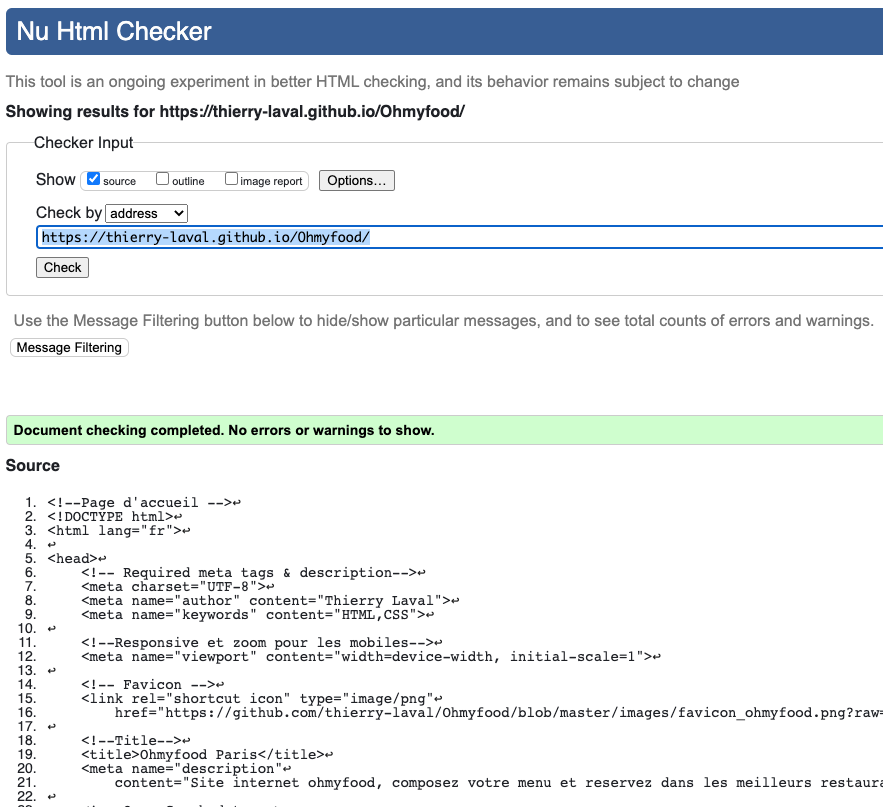

Début de formation le 20/04/2020

<H1>OpenClassrooms-Développeur Web
 Projet 3 - Création du site Ohmyfood! Paris</H1>

<h2>Construire un site pour pouvoir afficher les différents menus</h2>
https://openclassrooms.com/fr/projects/637/assignment

Dynamisez une page web avec des animations CSS 
Compétences évaluées:
- Mettre en œuvre des effets CSS graphiques avancés
- Assurer la cohérence graphique d'un site web
- Mettre en place une structure de navigation pour un site web

# 🔨 Utilisé dans ce projet

<h3> Validation du Html</h3>

Ici ce qui suit [Lien](https://github.com/thierry-laval/Ohmyfood/blob/master/Validation%20html.png "titre de lien optionnel").

